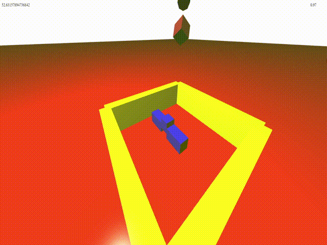
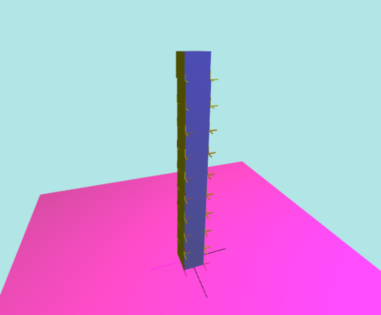
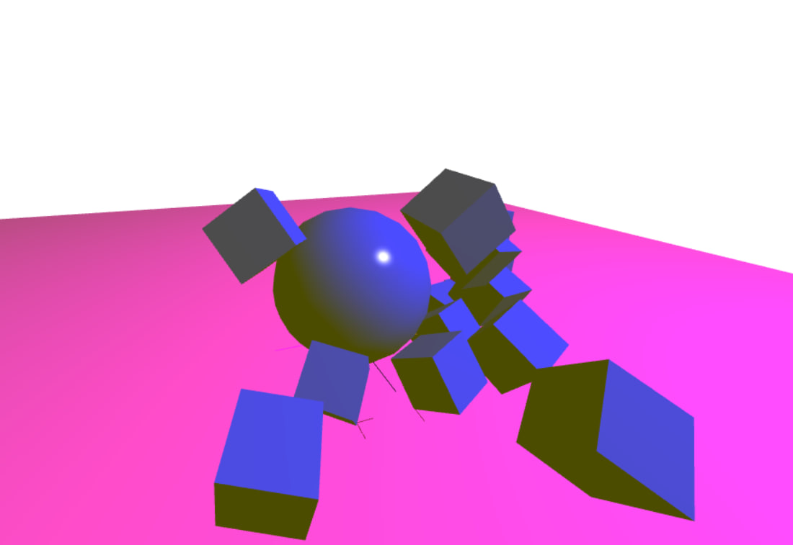

# Simple JavaScript Physics Engine
[Demo 1](https://romanppp.github.io/SimplePhysicsEngine/shapes)

[Box stack demo](https://romanppp.github.io/physicsEngineTS/demo/stack)

[Ball demo](https://romanppp.github.io/physicsEngineTS/demo/ball)

# Features : 
* Collision detection (AABB Tree for broadphase, GJK + EPA + Face clipping for narrowphase)
* Box, sphere, cylinder colliders
* Constraints resolution using Gauss Seidel
* Joint constraints
* Contact constraints
# TODO :
* More constraints
* Optimization