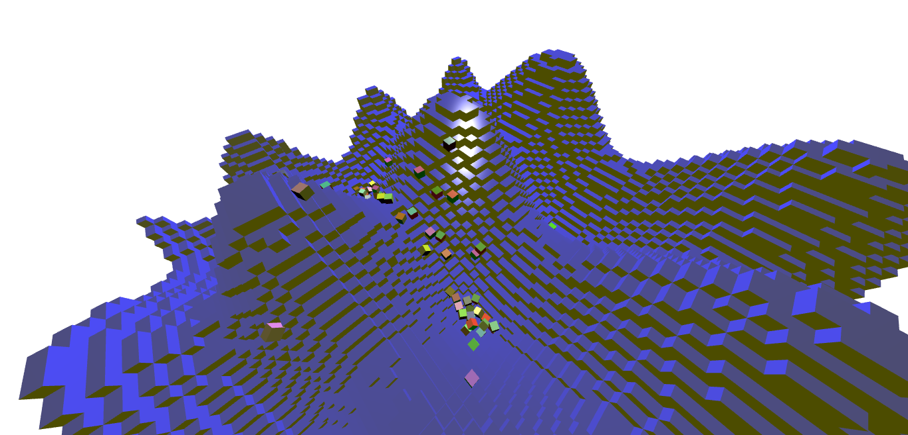

# Simple JavaScript Physics Engine

[Box stack demo](https://romanppp.github.io/TypeScript-Physics-Engine/demo/stack/stack.html)

[Wall demo](https://romanppp.github.io/TypeScript-Physics-Engine/demo/ball/ball.html)

[Voxel terrain demo](https://romanppp.github.io/TypeScript-Physics-Engine/demo/voxels/voxels.html)

# Features : 
* Collision detection (AABB Tree for broadphase, GJK + EPA + Face clipping for narrowphase)
* Box, sphere, cylinder colliders
* Constraints resolution using Gauss Seidel
* Joint constraints
* Contact constraints
# TODO :
* More constraints
* Optimization
